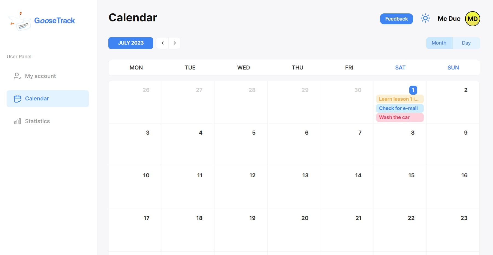
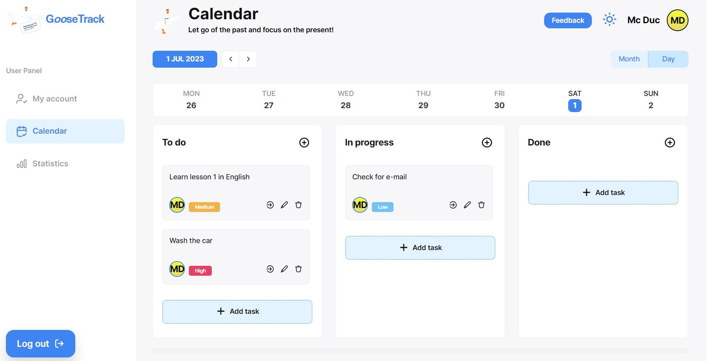
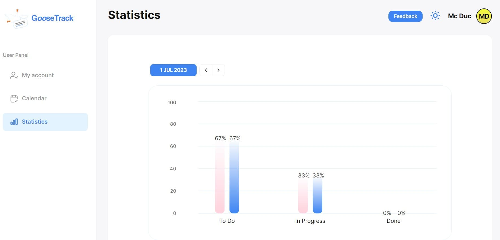
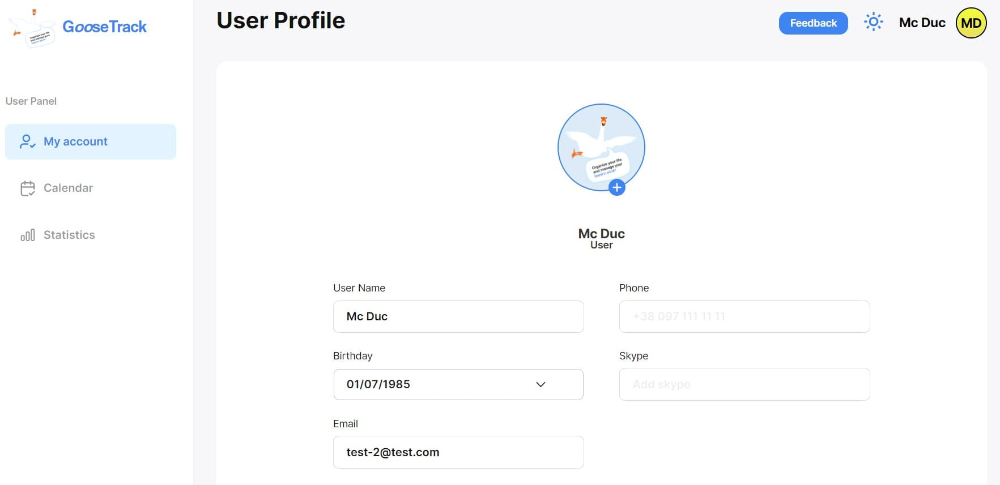
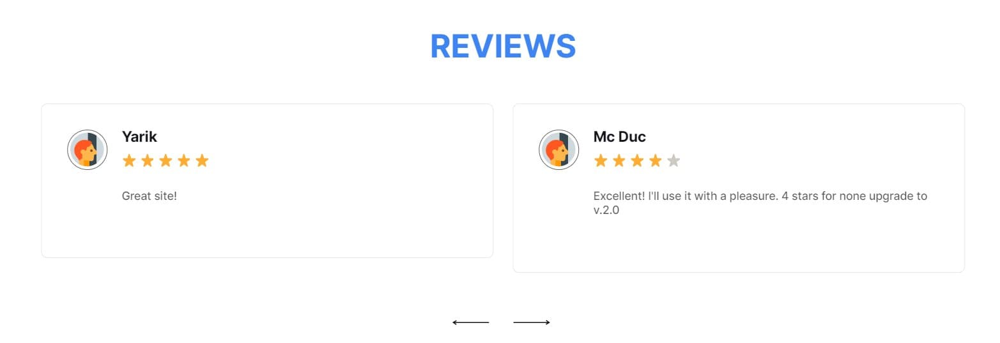

# GooseTrack

GooseTrack- це вебсайт для телефонів, планшетів, персональних комп'ютерів та
інших гаджетів, який являє собою календар для зберігання та відображення подій,
які користувач додає через свій кабінет. Сайт допомагає економити час і
ефективно планувати день.

Переваги GooseTrack

• Різні способи перегляду календаря – швидко перемикайтеся між режимами
перегляду місяця або дня.

• Завдання – створюйте й переглядайте свої завдання, а також керуйте ними в
Календарі.

• Світла/темна теми - користуйтесь сайтом зі цвітовою темою, яка вам більше
підходить

---

<a href="https://www.figma.com/file/kXtsjq7Tts3YzolUVqgNsp/Goose-Track?type=design&node-id=172-1012&mode=design&t=kZx2aNhGi8r3Pdbw-0">Макет
проекту</a>

### Календар

Календар на місяць 

Календар на день 

### Статистика

Статистика 

### Профіль користувача

Профіль користувача 

### Блок відгуків

Відгуки 

---

Проект розроблений командою  
Тім лід: <a href="https://github.com/vadrille12">Danil Zozulia</a>

Скрам майстер: <a href="https://github.com/mitrytk">Dmitry Tkachenko</a> -
ThemeToggler, UserInfo

Розробники:

- <a href="https://github.com/TaniaShmigel">Tetiana Shmigel</a> - сторінки
  RegisterPage и LoginPage, компоненти AuthNavigate
- <a href="https://github.com/Yaroslav12002">Yaroslav Mykhailov</a> - компонент
  ChoosedMonth
- <a href="https://github.com/SergeiTkachenko">Sergei Tkachenko</a> - компонент
  ChoosedDay
- <a href="https://github.com/MelnykY">Yuliia Melnyk</a> - сторінка MainPage,
  RegisterPage, LoginPage. Компоненти PublicRoute, PrivateRoute, Redax Auth.
  Підключення авторизації токена через Redux.
- <a href="https://github.com/NatalieUSA">Nataliia Khrystevych</a> - сторінка
  AccountPage (User Profile), Redux updateUser
- <a href="https://github.com/diana1m">Diana Malarcuk</a> - компонент відгуків
  AddFeedbackModal, кнопка AddFeedbackBtn
- <a href="https://github.com/MaxKorovchenko">Maxim Korovchenko</a> - Redux
  tasks, компонент TaskModal => Modal + TaskForm
- <a href="https://github.com/VlikToldo">Valentyn Taldykin</a> - створення
  глобальных states в Redux
- <a href="https://github.com/romis44">Roman Kovalchuk</a> - сторінка Statistics
- <a href="https://github.com/SashaMak19">Olexander Lukyianenko</a> - Google
  Auth
